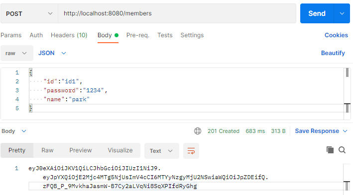
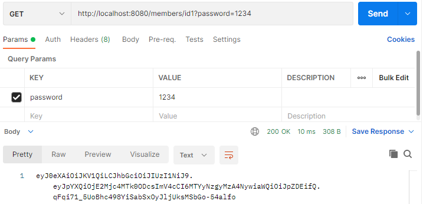
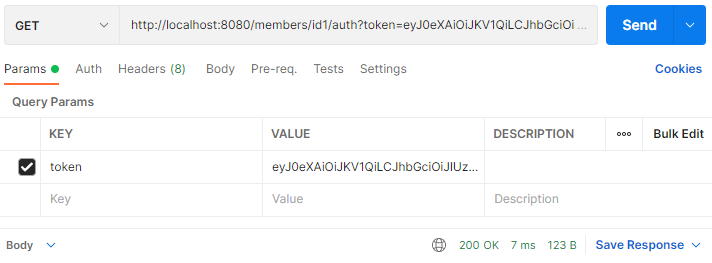

# JWT AccessToken 서버
## 개발 프레임워크
* Spring Boot
* Spring JPA
* ~~Spring Security~~

## 테이블 설계

|컬럼명|유형(type)|비고|
|------|---|---|
|UserId|Varchar(100)|-|
|Salt|Varchar(200)|-|
|HashedPassword|Varchar(500)|-|
|Name|Varchar(100)|-|

## 문제해결 전략
* 사용자 데이터 저장을 위해 h2활용, 필요시 다른 데이터저장소를 활용하여 영구 저장 가능 (https://www.baeldung.com/spring-boot-h2-database)
* 안전한 패스워드 관리를 위해 hashing에 Salt사용 (https://st-lab.tistory.com/100)
* JWT (https://dev.to/sureshdsk/how-jwt-json-web-token-authentication-works-2635) (https://shinsunyoung.tistory.com/110)
* ~~Spring Security를 활용한 JWT관리 (https://www.baeldung.com/tag/jwt/)(https://brunch.co.kr/@springboot/491)~~
* Spock을 이용하여 Unit Test 작성 (https://techblog.woowahan.com/2560/) (https://www.baeldung.com/groovy-spock)

## 빌드 및 실행방법
* 회원 가입

* 로그인

* token 확인
